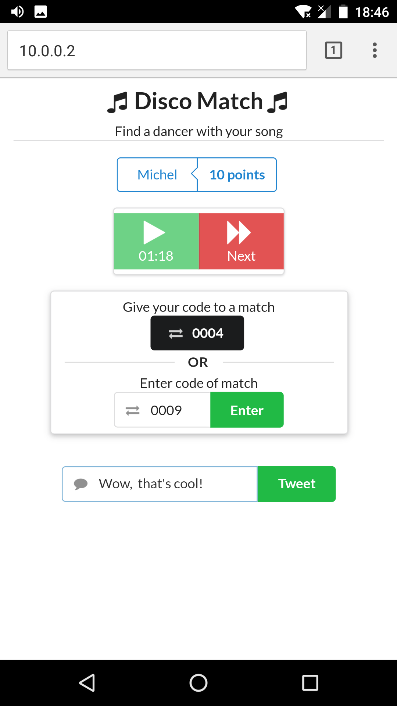
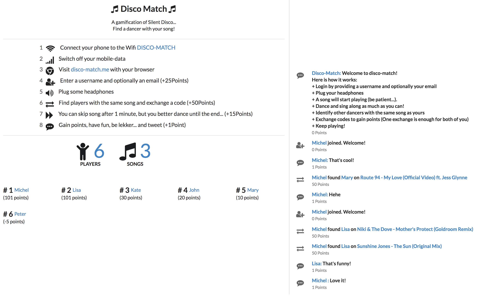
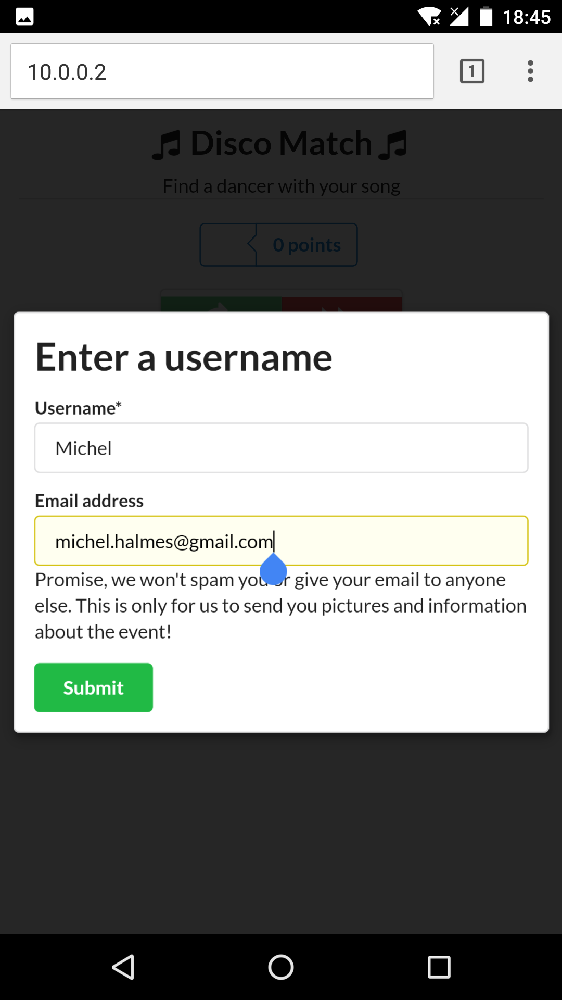
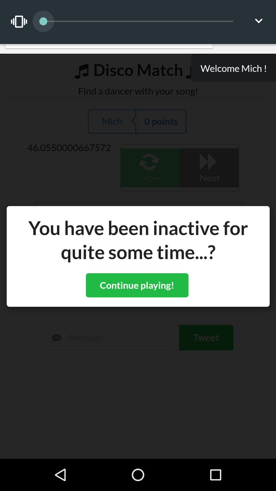

# Disco Buddy

This was a personal project to teach myself React.js. It is a gamification of "Silent Disco".

## How it works

Players connect to a server via a web-app.
A song starts playing and, by dancing and singing along, participants have to find someone with the same song.
Once they find each other, they exchange a code, which will give both players points.
A screen shows the players' ranking and an activity feed to which they can message.

